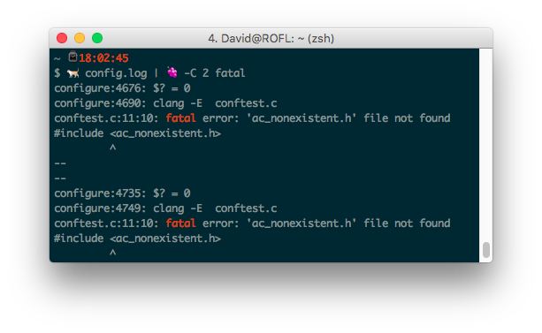

# emoji-term



## Supported commands

### System

| emoji | command |
|-------|---------|
| 🙌    | bless (OS X)|
| 🐈    | cat     |
| 📅    | cal     |
| 💿    | cd      |
| 💬    | chat    |
| 🆑    | clear   |
| 💑    | date    |
| 🚪    | exit    |
| 📠    | fax     |
| 🔍    | find    |
| 🖕    | finger  |
| 🙏    | fold    |
| 🆓    | free (Linux)  |
| 🍇    | grep    |
| 👪    | groups  |
| 🤕    | head    |
| 🗡    | kill    |
| 📍    | locate  |
| 👀    | look    |
| 🔑    | login   |
| 📬    | mail    |
| 👨    | man     |
| ⛰    | mount   |
| 🔓    | open (OS X)|
| 🏓    | ping    |
| 🚢    | port    |
| 😾    | puma    |
| 📖    | read    |
| 💩    | rm      |
| 👄    | say (OS X)|
| 📺    | screen  |
| 🔄    | shift   |
| 📏    | size    |
| 💤    | sleep   |
| 🏃    | swift   |
| 👔    | tie     |
| ⏰    |time    |
| 👣    | toe     |
| 🔝    | top     |
| 👉    | touch   |
| 📐    | units   |
| ⏱    | wait    |
| 🚽    | wc      |
| 🤔    | what    |
| 🤷   | whoami (Unicode 9.0) |
| 👍   | yes     |
| 🤐    | zip     |

### User

| emoji | command |
|-------|---------|
| ⚛     | [atom](https://atom.io) |
| 🍺    | [brew](https://brew.sh) |
| 🐗    | [grunt](https://gruntjs.com) |
| ☕     | [java](http://java.com)    |
| 🐘    | [pgsql](http://www.postgresql.org)
| 🐍    | [python](https://www.python.org) |
| 🛤    | [rails](http://rubyonrails.org) |
| 💎    | [ruby](https://www.ruby-lang.org)    |
| ♨️    | [spring](https://github.com/rails/spring) |
| 🦄    | [unicorn](https://unicorn.bogomips.org/) |

## Installation

```bash
git clone https://github.com/xxdavid/emoji-term
cd emoji-term
./install.rb
echo 'export PATH=$PATH:~/emoji-term/bin' >> ~/.zshrc
```

Only tested on OS X (10.11).

## Contribute
Feel free to add your favourite commands and emojis.
